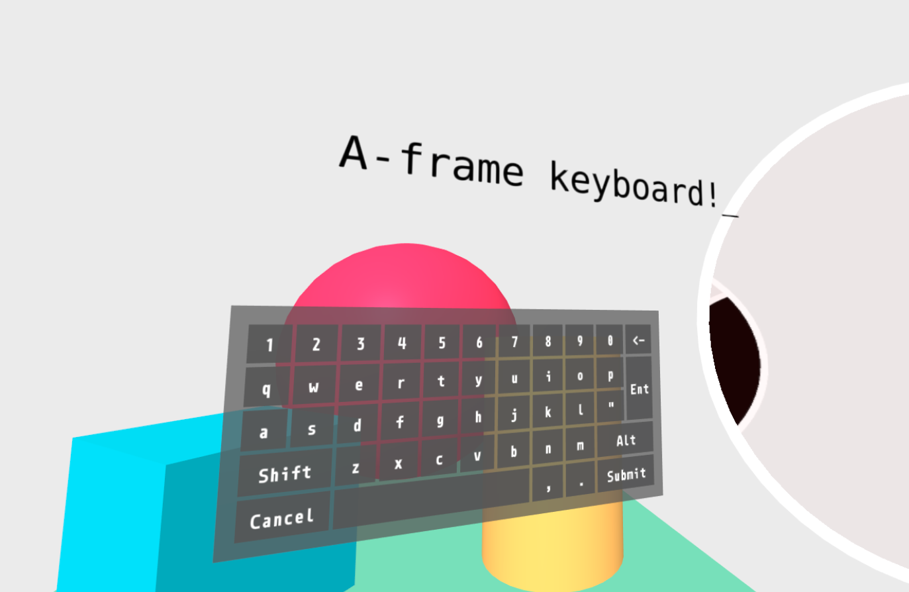

# aframe-keyboard
> An Aframe component that renders a fully functional 3D keyboard, that works on mobile, desktop browers, and VR headsets!

Noticing the lack of variety of libraries available for a-frame and WebVR in general, I decided to make my own library that can support customization to fit various projects (like adding your own keyboard key models to it, or setting font types and colors), and if possible, adding multi-lingual support by parsing through a JSON-formatted keyboard layout (see files in `src/i18n` for details)

The project is still very much in its infancy, so any feedback on what would create **a better user experience** or **easier/more useful features for developers to use this library** would be greatly appreciated!

## Setup
This project is written purely with javascript, and it makes use of custom event handlers to return which key has been pressed by the user (what you want to do with the returned value however, is up to you to implement). 

1. Import [aframe](https://aframe.io) into your project (it should load before any other aframe lib)
2. Add the file `dist/aframe-keyboard.min.js` to your project and load it into a `script` tag
3. Following the example project in `examples/basic/index.js`:
  * Add a scene to you `html` document, and inside it at an `a-entity` element
  * Set its `id` to `keyboard`, and add the `a-keyboard` attribute to it
  * Add a mouse entity to collide with the keyboard by adding an `a-entity` with the attributes `raycaster="objects: .collidable" cursor="rayOrigin: mouse"`
  * Add the `keyboard-shortcuts="enterVR: false"` attribute to the scene element to prevent it from triggering the VR mode when pressing `F` on desktops (users can still enter it by pressing the button in the bottom-right corner)
  * Add an event listener for the `a-keyboard-update` event, and add a handler method for it (a basic one has been provided in the example)

### API
| Property | Description | Default value |
| :--: | :--: | :--: |
| audio | (WIP) Relative path to sounds that should be player when a key is pressed | '' |
| baseTexture | Relative path to a custom texture that will replace the default keyboard base | '' |
| color | The color of fonts used in the keyboard | '#fff' |
| dismissable | Allows the user to dismiss the keyboard before pressing the submit button | true |
| font | Either a [stock font](https://aframe.io/docs/0.9.0/components/text.html#stock-fonts) key provided by aframe, or the relative path for a custom font that will be displayed on the keyboard | 'monoid' |
| fontSize | Size of each character printed (in aframe units) | '0.35' |
| highlightColor | The color that keys should highlight to when hovered | '#1a79dc' |
| keyTexture | Relative path to a custom texture that will replace the default keys | '' |
| locale | Sets which keyboard will be utilized from the `i18n` folder. Currently only `en` is supported, but additional language support is planned | 'en' |
| verticalAlign | Setting the text's [baseline](https://aframe.io/docs/0.9.0/components/text.html#properties_baseline), can be set as `top`, `center`, and `bottom`  | 'center' |

### Events

| Event Name | Function | Notes | 
| :--: | :--: | :--: |
| `a-keyboard-update` | Returns the keycode value of the key that was pressed | The `Submit` key returns code `999`, and the `Cancel` key returns `998` (specific logic about _how_ to remove your keyboard is best left to each developer, you may want to set `visible` to `false` or entirely remove the entity) |

## Release History
Please see `CHANGELOG.md` for more information on releases.
  
## License
Distributed under the MIT license. See `LICENSE` for more information.

## Roadmap (order of priority)
- [ ] Changing positioning of Dismiss / Submit buttons to improve UX
- [ ] Adding `audio` option to add sound effects to keyboard
- [ ] Adding symbols to `Enter` and `Backspace` keys instead of presenting text
- [ ] Adding ability to move keyboard position in VR mode (by physically dragging it)
  - [ ] Add option to keep keyboard always fixed in place

## Contributing
1. Fork it (<https://github.com/WandererOU/aframe-keyboard/fork>)
2. Create your feature branch (`git checkout -b feature/fooBar`)
3. Commit your changes (`git commit -am 'Add some fooBar'`)
4. Push to the branch (`git push origin feature/fooBar`)
5. Create a new Pull Request
